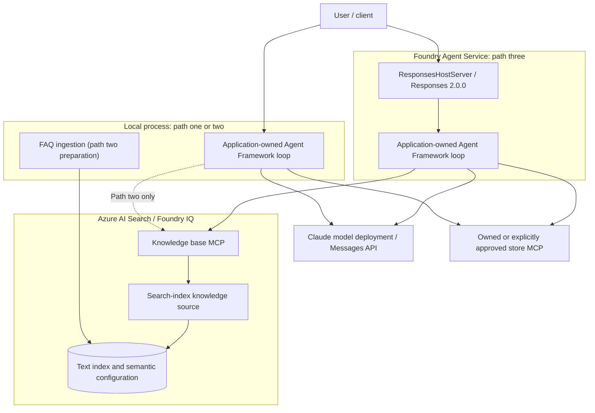

# Claude on Foundry Workshop: Research and Practical Guide

[中文](claude-on-foundry-workshop-guide.md) | [Repository home](README.en.md) | [Existing AOAI manual (Chinese)](azure-foundry-aoai-guide.md)

> **Scope and date:** For developers and architects familiar with Python, Azure, and basic API calls who want to understand agent orchestration. This is independent research and operational guidance, not an executable project or a validated deployment runbook. Sources reviewed on **2026-09-29**.
>
> **Not run:** This work only examined public source code and official documentation. We did not install sample dependencies, run upstream programs, call models or MCP servers, upload the FAQ, deploy, or modify Azure resources. Every “expected observation” and checklist item is for readers to verify later, not a test result from this work. Even an agent running locally can call billable cloud models and remote tools.

## Navigation

[1. Scope and conclusions](#scope) · [2. Repository map and architecture](#architecture) · [3. Prerequisites and configuration](#prerequisites) · [4. Local agent](#local) · [5. Foundry IQ](#iq) · [6. Hosted agent](#hosted) · [7. Issues and adaptations](#issues) · [8. Production and troubleshooting](#operations) · [9. Checklist](#checklist) · [10. Sources and attribution](#sources)

<a id="scope"></a>
## 1. Scope and conclusions

The research subject is Shilpa Jain's [Claude-on-foundry-handsonworkshop][S1], pinned to **`4326fb9c76cdac1f1b6e7444151e32fa99ec2e6e`** (2026-09-16; still upstream main HEAD when checked on 2026-09-29). All upstream file links below use that commit. Microsoft Learn links are living official pages, not a statement of the SDK contract at the time of that commit.

| Evidence label | Meaning |
| --- | --- |
| Source-confirmed | Files, configuration, or control flow at the pinned commit directly support the finding |
| Official documentation | Product guidance as reviewed on the stated date; the actual subscription, region, model, and version still need checking |
| Suggested adaptation | A proposed change for readers' own implementations; this repository does not modify or deliver the upstream application |
| Unverified | Installation, execution, authorization, reachability, compatibility, or cloud results have not been tested |

**Key conclusions:**

1. Claude supplies model inference; `Agent`, sessions, and the MCP invocation loop belong to the application-owned **Microsoft Agent Framework**. This is neither Claude Code nor the Claude Agent SDK coding-agent runtime. [S2], [D2]
2. The three paths build on each other but are different: local tool agent → add Foundry IQ retrieval → host similar orchestration code on Foundry Agent Service. A successful model deployment does not mean an agent has been deployed.
3. FAQ ingestion creates text fields and a semantic configuration. It has **no vector fields, embedding generation, or vector retrieval configuration**, so it must not be described as an implemented vector RAG pipeline.[S4]
4. Claude inference uses the **Messages API**; the hosted sample exposes the **Responses protocol** to clients. Its external protocol does not change the internal model API. [S6], [D1], [D5]
5. The upstream sample has path, packaging, and version boundaries. Current provider imports, Search APIs, and azd configuration differ from the sample; **pinning source does not lock dependencies or establish reproducibility**.

This guide does not label every capability GA or Preview. For example, current official documentation calls the Hosted Agents managed service GA, while the Python `agent-framework-foundry-hosting` integration remains prerelease. Search GA and preview APIs also expose different capabilities. [D3], [D9]

<a id="architecture"></a>
## 2. Repository map and architecture

### 2.1 Pinned repository map

These locations are in the **upstream repository**, not application files added to this repository.

| Upstream location | Purpose and boundary |
| --- | --- |
| [README.md][S1], [requirements.txt][S8] | Local introduction; declares Python 3.10+, with unpinned dependencies |
| [agent.py][S2] | Claude client, explicit MCP connection, prompt retrieval, and a single-session interaction loop |
| Root `env.template`, `env_template`, `env.txt` | These names exist in the tree; the README's `.env.template` does not. Their actual configuration values were not read or copied for this guide |
| [FoundryIQ/agent_IQ.py][S3] | Offers both the store business MCP and KB MCP, selecting tools according to the question |
| [FoundryIQ/ingest_foundry_iq.py][S4] | Chunks content, creates an index, uploads documents, and creates a knowledge source and knowledge base |
| [FoundryIQ/Store FAQ/cupcake-store-info.md][S5] | Actual FAQ location, different from the script's default relative path |
| [FoundryIQ/requirements-ingest.txt][S9], `FoundryIQ/env_template` | Ingestion dependency declaration and environment-template name |
| [hosted-cupcake-agent/README.md][S10], [azure.yaml][S7] | Hosted instructions, service declaration, runtime, and environment injection |
| [hosted-cupcake-agent/src/cupcake-agent/main.py][S6] | Wraps the application agent in `ResponsesHostServer` |
| [hosted-cupcake-agent/src/cupcake-agent/requirements.txt][S11] | Hosted dependencies; the same directory contains `env.template`, `env_template`, and `env`, but no `.env.template` |

The pinned tree does not include a store MCP server implementation, `.agentignore`, or VS Code `launch.json`. The upstream descriptions of F5 debugging and package exclusions are not evidence that those capabilities were delivered.

### 2.2 Claude Workshop Architecture



### 2.3 Legend

Solid arrows indicate calls or data dependencies; the dashed arrow is the local KB connection enabled only in path two. Groups distinguish process/service responsibilities, not configured VNets, private endpoints, or residency boundaries. This is a static source-based diagram, not an execution trace; local and hosted are alternative execution locations.

### 2.4 Key relationships

The application agent receives user messages, requests inference from Claude, executes selected tools through an MCP client, and returns tool results to the model. The root sample also fetches instructions and a welcome banner from the store MCP, so that external service both receives tool arguments and can influence agent behavior. Paths two and three use instructions defined in code and add the KB tool. [S2], [S3], [S6]

Foundry IQ is a knowledge layer built on Azure AI Search. A knowledge source points to the index, and a knowledge base organizes retrieval; neither is the Claude model deployment in this example. Hosted Agents manages code and an agent endpoint. Wrapping code in `ResponsesHostServer` does not automatically create the FAQ index, KB, or store backend. [D3], [D5]

<a id="prerequisites"></a>
## 3. Prerequisites and configuration matrix

### 3.1 Check Claude-specific eligibility first

The [official Claude deployment guide][D1] requires a valid payment method, a supported billing country/region, a Foundry project in a supported deployment region, and permission to subscribe to the model's Marketplace offer. The current unsupported cases include **CSP subscriptions, Enterprise Accounts located in South Korea, student/trial/startup-credit accounts without an active pay-as-you-go billing method, and sponsored subscriptions using Azure credits only**; applicable accounts with a credit card may instead be charged to that card. The existing AOAI manual's general PAYG / EA / CSP wording is not a Claude support commitment.

At deployment time, check the exact model, version, region scope, and terms on the model card. Official guidance distinguishes **Hosted on Azure (version 2)** from **Hosted on Anthropic infrastructure (version 1)**, and lists Global Standard, Data Zone, and other available choices per model/version. Do not infer identical residency, authentication, or capabilities for all versions. Some Claude models support Entra ID only, so the upstream API-key-only construction is not universal.[D1]

### 3.2 Endpoints are not interchangeable

| Object | Placeholder/form | Purpose |
| --- | --- | --- |
| Foundry resource | `<resource>` and its Azure Resource ID | Azure resource, IAM, quota, and billing context; not a chat URL |
| Foundry project endpoint | `https://<resource>.services.ai.azure.com/api/projects/<project>` | Project/agent management; do not use as the Claude `base_url` |
| Claude model base URL | `https://<resource>.services.ai.azure.com/anthropic` | Meaning of `FOUNDRY_ENDPOINT` in this example; verify against deployment details |
| Claude Messages request URL | The base URL above plus `/v1/messages` | The SDK constructs requests from the base URL; do not pass the complete request URL as the base URL again |
| Model deployment name | `<claude-deployment-name>` | Passed as `model`; can differ from the catalog model ID, and is not a project or agent name |
| Search service endpoint | `https://<search-service>.search.windows.net` | Service containing the index/KB, not the Foundry model endpoint |
| KB MCP URL | `https://<search-service>.search.windows.net/knowledgebases/<kb-name>/mcp?api-version=2026-05-01-preview` | URL constructed by the **pinned upstream version**, not a universal current API-version recommendation |
| Hosted agent Responses URL | `<project-endpoint>/agents/<agent-name>/endpoint/protocols/openai/responses` | Current official agent invocation form; prefer the actual protocol endpoint returned by deployment |
| Store MCP | `https://<your-approved-mcp-host>/mcp/` | Owned/approved service; this guide neither provides nor probes the author's external address |

Model endpoint guidance follows the Claude-specific page.[D1] The current provider page also shows `/models/anthropic` in a generic `AnthropicClient` example. This guide **does not treat that path and `/anthropic` as interchangeable**; check actual deployment details and the selected client.[D2] Agent endpoint guidance follows the Hosted Agents documentation.[D5]

### 3.3 Identity and least privilege

| Operation | Upstream behavior | Official requirements or later adaptation |
| --- | --- | --- |
| Deploy Claude/subscribe to its offer | Samples assume this is already done | Resource-group Contributor / Owner and Marketplace subscription permissions; these are deployment permissions, not roles for an ordinary inference process.[D1] |
| Claude inference | All three agents explicitly pass `api_key` | Use the matching key only for a model that permits it. The Entra example uses `https://ai.azure.com/.default`; the Claude troubleshooting page lists **Cognitive Services User**. Do not simply reuse AOAI-specific roles.[D1] |
| Create Search index, knowledge source, and KB | Ingestion uses `AzureKeyCredential` when a key is present, otherwise `DefaultAzureCredential` | An admin key, or **Search Service Contributor** for object management with Search RBAC enabled. [S4], [D3], [D10] |
| Upload Search documents | Ingestion uses the same credential | Entra also needs **Search Index Data Contributor**; permission to create an index does not imply permission to upload documents.[D10] |
| Query KB MCP | IQ/Hosted require `AZURE_SEARCH_API_KEY`, inserted into `api-key` through `header_provider` | The MCP-specific section lists **a bearer token (recommended) or an admin key**. Entra querying uses **Search Index Data Reader**, with scope `https://search.azure.com/.default`. Do not apply the ordinary retrieve/query API's query-key guidance directly to MCP.[D4] |
| Hosted deployment and execution | Upstream code still uses model/Search keys | Current deployment documentation requires **Foundry Project Manager** at project scope (formerly Azure AI Project Manager). The deployer, platform agent identity, and project managed identity are separate principals; hosting does not automatically convert explicit key code to keyless authentication. [D5], [D6] |

Separate ingestion write permissions from agent query permissions in production. Migrating to Entra requires implementing the correct client authentication, token refresh, and MCP headers; deleting keys from `.env` is not enough. Only ingestion has credential fallback; IQ/Hosted currently lack a Search bearer-token branch. [S3], [S4], [S6]

### 3.4 Upstream environment-variable mapping

These names describe the pinned source. All values are placeholders, not copied upstream environment values.

| Variable | Local path one | IQ path two | Hosted path three | Value/caveat |
| --- | --- | --- | --- | --- |
| `FOUNDRY_MODEL_DEPLOYMENT` | Required | Required | Required | `<claude-deployment-name>` |
| `FOUNDRY_API_KEY` | Required | Required | Required | `<foundry-api-key>`; only for models that permit keys |
| `FOUNDRY_ENDPOINT` | Required | Required | Required | Claude base URL, not the project endpoint |
| `AZURE_SEARCH_ENDPOINT` | Unused | Required by ingestion/agent | Required | Search service endpoint |
| `AZURE_SEARCH_API_KEY` | Unused | Optional for ingestion with Entra fallback; required by agent | Required | See the MCP admin-key/bearer-token distinction above |
| `KNOWLEDGE_BASE_NAME` | Unused | Optional for agent | Optional | Defaults to `cupcake-store-kb`; ingestion uses a **code constant** with the same name, not this variable |
| `CUPCAKE_MCP_URL` | **Not read**; URL is hard-coded | Optional, but explicitly override it | Optional, but explicitly override it | `<your-approved-mcp-url>`; IQ/Hosted still default to the author's service |

**Migration gate for current Hosted tooling:** The [current azd YAML reference][D7] uses an `env` map and reserves the `FOUNDRY_` / `AGENT_` prefixes, whereas upstream injects custom `FOUNDRY_*` values through `environmentVariables`. With current tooling, consistently rename these in your own copy, for example `FOUNDRY_MODEL_DEPLOYMENT` → `APP_CLAUDE_DEPLOYMENT`, `FOUNDRY_API_KEY` → `APP_CLAUDE_API_KEY`, and `FOUNDRY_ENDPOINT` → `APP_CLAUDE_BASE_URL`, updating Python reads, YAML mappings, and azd environment configuration together. Do not override the platform-injected `FOUNDRY_PROJECT_ENDPOINT`. These are untested migration proposals, not applied patches; the table retains original names for reading the source.

### 3.5 Runtime and dependency boundaries

| Path/component | Pinned upstream | Current official comparison and requirements |
| --- | --- | --- |
| Root local example | README: Python 3.10+; unpinned `agent-framework`, `agent-framework-foundry`, `agent-framework-foundry-hosting`, `azure-identity`, `python-dotenv` | The declared Python minimum does not prove compatibility with every current dependency. [S1], [S8] |
| Anthropic provider | All three agents import `AnthropicFoundryClient` from `agent_framework.foundry` | Current Python documentation lists `agent-framework-anthropic` and imports from `agent_framework.anthropic`. Root requirements do not explicitly list the package; Hosted requirements do. This does not prove the old import fails in every version.[D2] |
| Native model SDK | Upstream uses the Framework wrapper | The official native Python Claude sample uses `from anthropic import AnthropicFoundry`; do not confuse it with Framework's `AnthropicFoundryClient`.[D1] |
| IQ ingestion | Unpinned `azure-search-documents`, `azure-identity`; the script also imports `dotenv` | Ingestion requirements alone do not include `python-dotenv`; use the root dependencies or supply it in your own environment. The SDK must expose the KB types used by the script. [S4], [S9] |
| Search API | KB MCP pins `2026-05-01-preview`; ingestion does not explicitly set the SDK API version | Current docs: `2026-04-01` is the GA minimal extractive path; `2026-08-01-preview` exposes corresponding preview capabilities. Check create, retrieve, MCP, and SDK operations separately; **do not globally replace version strings**. [D3], [D4] |
| Hosted | `python_3_13`, `main.py`, `remote_build`, Responses `2.0.0`; hosting package `>=1.0.0a260630` | A lower bound is not a lockfile. Current docs confirm `ResponsesHostServer`, but the Python hosting integration remains prerelease. [S7], [S11], [D9] |
| azd extensions | Requires only `azure.ai.agents >=1.0.0-beta.4` | Current YAML docs require `azure.ai.agents >=1.0.0-beta.8` and `azure.ai.projects >=1.0.0-beta.4`. This guide does not claim that the newer combination has been validated with upstream YAML.[D7] |

No “known-good tested version set” is supplied here. First choose whether to preserve historical APIs or migrate to current APIs, inspect package metadata, imports, schemas, and dependency conflicts in an isolated environment, and record actual versions. Installing everything at latest is not a compatibility fix.

<a id="local"></a>
## 4. Path one: Local Claude + MCP agent

**Goal:** Understand how an application process uses Claude inference and store tools. Prerequisites are your own model deployment, suitable identity, and a reviewed MCP service that you own. A model key alone is insufficient to run the complete example.

### 4.1 Obtain and review the pinned source

Obtain upstream in a separate experiment directory outside this repository. The following commands are **instructions for readers, not commands executed for this guide**:

```powershell
git clone https://github.com/ShilJain/Claude-on-foundry-handsonworkshop.git
Set-Location .\Claude-on-foundry-handsonworkshop
git checkout --detach 4326fb9c76cdac1f1b6e7444151e32fa99ec2e6e
```

Read [agent.py][S2] and [requirements.txt][S8], address the provider/dependency differences in section 3.5, and remove the unnecessary standalone `exit` expression in your own copy. It is not `exit()` and normally does not terminate the program; it can also fail in environments that do not supply that interactive helper name.

### 4.2 Prepare configuration and an approved service

The real root template is named `env.template`, not `.env.template`. Prefer creating **your own** local `.env` from section 3.4, using only your deployment values. Do not reuse any upstream accounts, keys, or addresses, and establish your own Git and package exclusions.

Root `agent.py` **does not read `CUPCAKE_MCP_URL`**. In your copy, replace its hard-coded URL with an owned/approved service, or first add explicit environment reading and missing-value errors. Your service must expose the sample's `agent_instructions` and `welcome_banner` prompts and reviewed business tools. The repository contains no server implementation, so tool names, arguments, and availability cannot be promised.

Do not connect to the author's service just to inspect a welcome message: `connect()` / `get_prompt()` already involve remote interaction. Review the trust level of external instructions and retain final system-policy control in your application.

### 4.3 Prepare an isolated environment and start

After selecting versions and completing those adaptations, create a virtual environment at the upstream root and install **reviewed** dependencies. For example:

```powershell
python -m venv .venv
.\.venv\Scripts\python.exe -m pip install -r .\requirements.txt
.\.venv\Scripts\python.exe .\agent.py
```

These commands are not a reproducibility guarantee for unmodified source: the original requirements are unpinned and do not explicitly declare the current Anthropic provider. Do not repeatedly install arbitrary versions after import failures. Starting the program connects to MCP and automatically sends `hello` to the agent, potentially triggering model and tool calls.

### 4.4 Observe and terminate safely

The source sequence is: load `.env` → construct Claude client → MCP `connect()` → two `get_prompt()` calls → create `Agent` → `create_session()` → automatic greeting → repeated `agent.run()` calls in the same session. Expected observations are a service-provided banner, model response, and interaction prompt. Begin with read-only inventory/product questions and confirm the actual tool calls through tracing, rather than treating natural-language answers as proof.

The root sample calls `close()` only after the loop exits normally; exceptions, cancellation, and Ctrl+C do not guarantee cleanup. Use context management or `try/finally` supported by the chosen SDK, then separately verify `exit` / `quit`, exceptions, and interruptions. Do not test ordering on a system without approval and idempotency controls.

<a id="iq"></a>
## 5. Path two: Add Foundry IQ

**Goal:** Route store actions to the store MCP and policies such as hours, delivery, and returns to the KB MCP. In addition to the boundaries established in path one, you need Azure AI Search with the required capabilities, semantic retrieval configuration, and separate ingestion/query permissions. [S3], [D3]

### 5.1 Align document paths and names

The FAQ is at `FoundryIQ\Store FAQ\cupcake-store-info.md`. The script's `DOCUMENT_PATH = "cupcake-store-info.md"` is relative to the **working directory**, not the script directory. There are two possible adaptations:

| Approach | Action | Boundary |
| --- | --- | --- |
| Keep the original path constant | Run `..\ingest_foundry_iq.py` from `FoundryIQ\Store FAQ` | The commands below use this approach; dependencies must already be installed and the process environment/local `.env` must be available to the script |
| Use an explicit path | In your own copy, resolve `Store FAQ\cupcake-store-info.md` relative to the script directory | Requires an application change and verification; merely changing into `FoundryIQ` does not fix the original constant |

Default object names are `cupcake-store-index`, `cupcake-semantic`, `cupcake-store-ks`, and `cupcake-store-kb`. All are code constants in ingestion. If using your own names, update the index, knowledge source, KB, and agent's `KNOWLEDGE_BASE_NAME` together. Do not overwrite same-named objects in a shared service.

### 5.2 Understand what ingestion actually does

The script chunks Markdown at level-two headings; nonempty opening content can also become a chunk. It uploads string fields `id`, `title`, `category`, and `content`, with a semantic configuration using the title, category, and body. It then creates a search-index knowledge source and a KB referencing that source.[S4]

**There is no embedding call, vector field, or KB LLM configuration.** This alone does not establish that KB creation must fail: current official `2026-04-01` supports minimal extractive retrieval without an LLM; `2026-08-01-preview` makes an LLM optional for non-web sources, while web sources have an LLM requirement. If later enabling KB query planning/answer synthesis, configure a supported model, Search service identity, and model access separately. The KB does not automatically reuse the agent's Claude client.[D3]

Those current rules do not prove compatibility between upstream's unpinned SDK and `2026-05-01-preview`. First check the chosen version's `KnowledgeBase`, knowledge-source schema, default retrieval behavior, and MCP tool schema.

### 5.3 Review before uploading, then run ingestion

Run only against your own experiment resources. Review the FAQ's data authorization and contents, confirm the effects of each `create_or_update_*`, configure section 3.3 permissions, and install root dependencies plus version-reviewed ingestion dependencies in your experiment environment. `requirements-ingest.txt` alone does not include `python-dotenv`.

The following starts at the **upstream root**, assuming the `.venv` from section 4:

```powershell
.\.venv\Scripts\python.exe -m pip install -r .\FoundryIQ\requirements-ingest.txt
Push-Location '.\FoundryIQ\Store FAQ'
try {
    ..\..\.venv\Scripts\python.exe ..\ingest_foundry_iq.py
} finally {
    Pop-Location
}
```

These commands create/update Search objects and upload content; they were not executed here. Expect a chunk count followed by index, upload, source, and KB logs. **A “ready” log is not acceptance evidence**: the script only counts `succeeded` items and continues after partial upload failure. Inspect each upload result, failure reason, actual document count, and KB retrieval result. Stop subsequent steps on failure rather than accepting answers from incomplete content.

### 5.4 Connect the KB MCP

Before running `.\.venv\Scripts\python.exe .\FoundryIQ\agent_IQ.py` from the upstream root, configure your Search endpoint, authentication, KB name, and store MCP URL. Section 3.2 shows the pinned KB URL constructed by the agent. It injects `api-key` through `header_provider`; `load_prompts=False` disables KB prompt loading only, not KB tools or authentication.[S3]

The official KB endpoint exposes `knowledge_base_retrieve`. This application connects directly to Search MCP; it does not need an extra Azure OpenAI Responses call. The official page's Responses example is one possible MCP client, not a requirement to change this sample's model.[D4]

Unlike the root sample, IQ does not explicitly call `connect()` / `close()`. Do not declare this a bug, or assume automatic connection works, without version-specific verification. Confirm tool initialization, lifecycle, exception cleanup, and header refresh against the selected Framework version.

### 5.5 Verify with distinguishable tasks

Expect “What is the returns policy?” to use KB retrieval, and “What is in stock?” to use the store tool. Answers should be traceable to actual documents or tool results. Also test absent document answers, KB permission denial, and tool disconnection to ensure the agent does not invent policies or successful orders. “I searched the knowledge base” in natural language is not invocation evidence; compare logs/traces with source documents.

Retrieved data can be sent to Claude to generate the final answer. This FAQ index does not configure document ACLs or user-identity filtering. Foundry IQ's product support for permission-aware retrieval does not establish that this sample implements per-user access isolation. [S4], [D4]

<a id="hosted"></a>
## 6. Path three: Hosted agent

**Goal:** Expose the application orchestration as a service in Foundry Agent Service, not change Claude's model protocol. The model, Search objects, and approved store MCP from path two remain downstream dependencies.

### 6.1 Read the packaging boundary first

The project directory is `hosted-cupcake-agent`, and its service source directory is `src\cupcake-agent`.[S7] The pinned YAML declares `host: azure.ai.agent`, `kind: hosted`, `language: python`, `codeConfiguration.runtime: python_3_13`, `entryPoint: main.py`, `dependencyResolution: remote_build`, Responses `2.0.0`, and 1 CPU / 2Gi memory.

`main.py` validates five required settings through `require_setting()` (three model values and two Search values), constructs two MCP tools, and calls `ResponsesHostServer(create_agent()).run()`. [S6] Current official guidance describes `remote_build` as source ZIP upload with platform-side dependency resolution; it does not require readers to supply a Dockerfile. Do not mechanically add generic image/ACR steps to this path. [D6], [D9]

### 6.2 Complete migration checks before local execution

1. Use a Python 3.13 isolated environment matching the YAML. Review Hosted requirements' prerelease lower bound, provider import, and resolved versions.
2. The Hosted README refers to `src/cupcake-agent/.env.template`; the actual name is `src/cupcake-agent/env.template`. Build your own environment from the matrix, without copying upstream values.
3. Address reserved prefixes and the difference between `environmentVariables` and the current `env` schema as described in section 3.4. Update Python, YAML, and azd environment together, not just one file. Current docs also use `startupCommand` for local startup; check its role against `codeConfiguration.entryPoint`. [D7], [D8]
4. Current azd splits agent and project/infrastructure support across two extensions. Prepare them using section 3.5 and the official installation links; upstream's extension minimum does not establish that the current `microsoft.foundry` provider is ready.
5. Identify the intended tenant, subscription, project, and azd environment. CLI sign-in provides deployment/tool identity, not a replacement for application model/Search authentication. Replace the default store MCP address and verify that the cloud execution location can also reach downstream services.
6. **Deployment blocker:** Upstream lacks its promised `.agentignore` and VS Code launch configuration. Use exclusions supported by your selected tooling, inspect the actual package file list, and exclude `.env`, `.azure`, virtual environments, logs, and potentially configuration-bearing files such as `env` / `env_template`. Git ignores are not ZIP exclusions. Do not deploy an uninspected package.

### 6.3 Local host and local client

Once configuration, dependencies, and downstream services are ready, work from upstream's `hosted-cupcake-agent` directory. The upstream README gives `azd ai agent run --no-client`, followed in another terminal by `azd ai agent invoke cupcake-agent --local "hello, are you up?"`.[S10]

The [current official local-run guide][D8] documents these basic commands; they are not an execution record:

```powershell
azd ai agent run
```

In another terminal, enter the same project directory with the correct azd environment:

```powershell
azd ai agent invoke --local "Hello, what can you do?"
```

Check the selected extension's help for `--no-client`, service-name, and startup-command options. Current docs use `localhost:8088` by default, and `run` can install dependencies. **`--local` only places the agent host on your machine**; it does not make Claude, Search, or MCP local, nor guarantee offline, free, or side-effect-free execution.

Expect the local host to start, the client to receive a Responses-compatible reply, and tool traces to identify the correct downstream services. Verify continued conversation in one session and isolation between sessions. An in-process test is not proof of hosted persistence.

### 6.4 Conditional deployment workflow

The following describes later reader actions only. It requires approved resources, costs, permissions, and successful local verification.

| Stage | Action and expected observation |
| --- | --- |
| Initial preparation | Follow the [source-code deployment guide][D6] and its quickstart to initialize/associate the correct project, reviewing existing YAML rather than blindly regenerating it. Official `azd up` includes provision and deploy and can create resources, roles, and charges; use it only after reviewing targets and changes. |
| Existing resources, code-only deployment | Upstream lists `azd deploy cupcake-agent --no-prompt`. Interactive review is more suitable for an initial experiment; do not use `--no-prompt` with an uncertain target. First confirm the current environment is provisioned/associated, schemas are adapted, and runtime settings are injected. |
| Inspect the result | Use `azd ai agent show` to obtain the agent name, version, protocols, and endpoints; wait for version state `active`. Command completion or version creation is not evidence that downstream services work. |
| Cloud invocation | Use the selected tooling's invoke command against your own agent protocol endpoint, starting with read-only tasks. Verify the model, KB, and store MCP separately. Removing `--local` crosses the cloud-invocation boundary. |
| Operational handoff | Record the version, actual dependencies, permissions, budget, owner, and cleanup inventory; retain only redacted results. |

An upstream `.env` file does not automatically become the deployment environment. Current documentation supports runtime configuration through azd environment placeholders or Foundry connections; connection resolution must match the chosen tooling. [D7], [D8] Having a platform agent identity does not mean the existing explicit-key Claude/Search clients use it.

<a id="issues"></a>
## 7. Upstream issues and suggested adaptations

This is a static consistency and version-risk inventory, not a reproduced failure report or a comprehensive security audit. **No suggested fix was installation-tested, runtime-tested, or cloud-tested in this work.**

| ID | Source and finding | Impact | Suggested adaptation | Verification status |
| --- | --- | --- | --- | --- |
| W01 | [Root README][S1] and [Hosted README][S10] reference `.env.template`, absent from their pinned directories; actual names include `env.template` | Copy instructions can fail; readers might reuse someone else's configuration | Create your own configuration using the real locations; do not copy upstream values | Tree/documentation confirmed; execution unverified |
| W02 | [Root agent.py][S2] contains a standalone `exit` expression | Not an exit call; the name may be absent in some Python startup modes | Remove the unused expression | Source-confirmed; startup modes untested |
| W03 | [Root agent][S2] closes only on the normal path; [IQ][S3]/[Hosted][S6] lack explicit tool connection/cleanup | Exception cleanup and automatic connection depend on the SDK contract | Confirm lifecycle behavior; add appropriate context/cancellation cleanup | Source-confirmed; not a claim that every version fails |
| W04 | Three agents import `agent_framework.foundry.AnthropicFoundryClient`; current [provider docs][D2] use `agent_framework.anthropic` | Unpinned installations may differ in imports/behavior | Align provider package, imports, arguments, and tested versions | Source/official difference confirmed; compatible set unknown |
| W05 | [Ingestion][S4] uses a document-relative path different from the [FAQ][S5] location | Running from common working directories cannot locate the document | Use the correct working directory or resolve relative to the script | Static confirmation; no upload |
| W06 | [Ingestion][S4] only prints the upload success count before continuing to create the KB | Partial failure can still produce “ready” | Check every item, halt failed flows, verify document count and retrieval | Control flow confirmed; no fault injection |
| W07 | [IQ][S3]/[Hosted][S6] pin `2026-05-01-preview`, while ingestion's SDK is unpinned | Creation and MCP querying may use different contracts | Check SDK, schemas, and [GA/preview differences][D3] per operation, not by mechanical version replacement | Declarations confirmed; service compatibility unknown |
| W08 | Root URL is hard-coded; IQ/Hosted default to the same external MCP; no server source | Not self-contained; availability and cross-boundary data risks | Change root URL/add explicit configuration; override variables elsewhere; use owned/approved services only | Source-confirmed; external service **not probed** |
| W09 | [Hosted README][S10] promises `.agentignore` and debug configuration absent from the pinned tree | No assured package exclusions or F5 launch | Check supported ignores, actual ZIP contents, and startup settings | Tree confirmed; no packaging |
| W10 | [Root][S8]/[ingestion][S9]/[Hosted][S11] dependencies are unpinned or lower-bounded; ingestion omits a direct dotenv declaration | Different environments today; missing dependency in ingestion-only setup | Resolve, verify, and record versions and direct dependencies per isolated path | Declarations confirmed; no installation |
| W11 | [YAML][S7] has old extension minimums, `environmentVariables`, and custom `FOUNDRY_*` names differing from [current reference][D7] | Current deployment/environment injection cannot be assumed compatible | Align extensions, env map, reserved prefixes, and startup settings; validate packaging and runtime | Official/source difference confirmed; no deployment |
| W12 | [IQ][S3]/[Hosted][S6] use a Search key for MCP without bearer-token support | Admin key is overprivileged; an ordinary query key cannot be assumed to work | Adapt refreshing bearer-token authentication and query RBAC per the [MCP-specific section][D4] | Source/official confirmed; authorization unverified |
| W13 | [Ingestion][S4] uses name constants; the agent reads its KB name from the environment | Changing only `KNOWLEDGE_BASE_NAME` may target a nonexistent KB | Synchronize producer/consumer naming and avoid overwriting shared objects | Source-confirmed; resources not inspected |

<a id="operations"></a>
## 8. Production use, troubleshooting, and cleanup

### 8.1 Production readiness is not deployment success

| Topic | Controls to implement |
| --- | --- |
| Third-party data boundaries | Inventory recipients of user messages, tool arguments, retrieved chunks, model outputs, and logs. Review MCP operators, model hosting versions, retention/sharing/location terms. External results and prompts are untrusted input. |
| Secrets and identity | Keep keys out of code, docs, screenshots, command history, Git, and deployment packages. Use appropriate secret stores/connections and verify rotation/revocation. Prefer Entra, but actually implement authentication and least privilege. |
| Tool side effects | Ordering, cancellation, refunds, and similar actions need application-side authorization, human confirmation, argument validation, idempotency keys, and audit logs. Model instructions alone are insufficient. Read-only tests do not establish safe writes. |
| Content and access | Verify FAQ/retrieval sources, abstain when information is missing, and defend against injection. Implement and test tenant/document permissions separately when required; a shared Search key is not per-user authorization. |
| Reliability | Bound loops, tokens, timeouts, and retries. Avoid unconditional retries on writes. Explicitly surface unavailable tools/partial retrieval failure instead of false success. Verify cancellation, connection cleanup, session isolation, and persistence. |
| Monitoring | Record correlation IDs, actual tool calls, latency, throttling, and usage. Redact prompts, orders, documents, and authentication headers; restrict trace access and retention. |
| Costs | Budget separately for Claude tokens, Search capacity/semantic or agentic retrieval, optional KB LLM, Hosted runtime, monitoring/storage, and your MCP backend. Source deployment and `--local` do not imply zero cost; verify current service pricing and bills. |

Hosted documentation explicitly assigns responsibility for third-party data, costs, permissions, geographic boundaries, and application-safety decisions to the user. Platform hosting is not an endorsement of this sample's production readiness or compliance.[D5]

### 8.2 Troubleshoot by boundary

| Symptom | Check first |
| --- | --- |
| `ImportError` / missing `AnthropicFoundryClient` or KB types | Actual Python/SDK versions, provider import path, Search stable/preview types; do not change endpoints first |
| Template or FAQ `FileNotFoundError` | Real filename, working directory, and `DOCUMENT_PATH`; use the separate path-one/two/three instructions |
| Claude 401 / 403 | Model key support; key/resource match; Entra scope `https://ai.azure.com/.default`, Cognitive Services User, tenant, and network restrictions |
| Claude 404 / deployment not found | Confusion between `/anthropic` base URL and complete Messages URL; model ID/agent name supplied instead of deployment name |
| KB MCP 401 / 403 | Query key mistaken for MCP admin key; expired bearer token or non-Search scope; Search RBAC and networking |
| KB 400 / schema or API-version error | Creation SDK versus MCP API contracts, KB settings, and the selected API's LLM/retrieval mode; do not change all versions at once |
| Empty KB results, missing chunks, or ungrounded answers | FAQ path, each upload result, actual document count, semantic config, source/KB names, retrieval output, and evidence of real tool invocation |
| MCP connection or prompt error | Owned service reachability, authentication, Streamable HTTP and prompt/tool capabilities; availability of the root sample's two named prompts |
| Local Hosted connection refused | Whether host started, port conflicts, startup command, and current azd environment; do not redeploy cloud resources first |
| Hosted build/start failure | ZIP root layout, dependency resolution, Python 3.13, env schema/reserved prefixes, required settings; inspect the error for a `failed` version before runtime logs become available |
| 429 / timeout / unexpected cost | The particular model, Search, or tool quota; retry count, loop length, concurrency, and token limits |

Retain only redacted errors, timestamps, request IDs, and versions for diagnosis. Do not post authentication headers or complete customer documents in public issues.

### 8.3 Experiment owners are responsible for cleanup

First inventory agent names/versions, model deployments, KBs, knowledge sources, indexes, monitoring/storage, and MCP backends **actually created by this experiment**, and identify shared resources. Stop unneeded sessions/applications and clean up owned KBs, sources, and indexes in dependency order. Then use each service's official process for dedicated deployments, agent versions, and other dedicated resources. Preserve needed business records before deletion; never delete blindly based on sample names.

Revoke temporary roles, revoke/rotate potentially exposed keys, and remove local secrets, packages, and sensitive logs. Finally check bills and remaining resources. Deleting an agent does not prove that Search, models, logs, or third-party services stopped billing. This guide intentionally provides no bulk resource-group deletion or broadly destructive cleanup commands.

<a id="checklist"></a>
## 9. Reader verification checklist

**None of the following was executed in this research. Unchecked items mean no runtime evidence, not a reported failure.**

- [ ] Claude subscription, Marketplace, model/hosting version, region, authentication, and deployment name are confirmed.
- [ ] Python, package, SDK API, and azd extension versions are recorded per path, with no unexplained import/schema differences.
- [ ] Every endpoint is owned or explicitly approved; root hard-coding and IQ/Hosted third-party MCP defaults have been replaced.
- [ ] The local agent completes model inference, real read-only tool use, continued conversation, and interruption/exception cleanup.
- [ ] Ingestion uses the correct FAQ; every upload item succeeds, and document counts/index/source/KB names agree.
- [ ] KB MCP authentication, traceable answers, missing answers, and permission denial are verified without misrepresenting vector RAG or per-user ACLs.
- [ ] Current Hosted schema, reserved prefixes, startup, dependencies, and actual package exclusions are verified.
- [ ] The local Responses host and cloud agent are tested separately; the cloud version is `active`, and downstream calls/session isolation meet expectations.
- [ ] Writes have separate approval/idempotency policies; budget, redacted logs, alerts, and a cleanup owner are assigned.

<a id="sources"></a>
## 10. Sources, license, and attribution

This guide is an original synthesis of upstream architecture, implementation, and official materials, not a paragraph-by-paragraph translation of the original README or a repository copy. The [upstream LICENSE][S12] was checked: **MIT License, Copyright (c) 2026 Shilpa Jain**. If copying or adapting its code/substantial portions into your own application, retain the copyright, MIT permission notice, and disclaimer with the copies. The license does not grant access to the author's external MCP service or permission to use its data.

The limited operational commands here explain reader workflows. Upstream Python implementations and environment files are not redistributed. This documentation was prepared with AI assistance and still requires maintainer review before publication, deployment, or product selection, particularly for changing capability and permission statements.

### 10.1 Pinned upstream sources

| Label | Source |
| --- | --- |
| S1–S4 | [Root README][S1], [local agent][S2], [IQ agent][S3], [ingestion][S4] |
| S5–S7 | [FAQ][S5], [Hosted main.py][S6], [Hosted azure.yaml][S7] |
| S8–S12 | [Root dependencies][S8], [ingestion dependencies][S9], [Hosted README][S10], [Hosted dependencies][S11], [MIT LICENSE][S12] |

### 10.2 Official references (reviewed 2026-09-29)

| Label | Reference and purpose |
| --- | --- |
| D1 | [Deploy and use Claude][D1]: subscriptions, Marketplace, hosting versions, Messages API, authentication |
| D2 | [Agent Framework Anthropic provider][D2]: package, imports, clients, and application-owned loop |
| D3 | [Create a Search knowledge base][D3]: GA/preview, optional LLM, creation permissions |
| D4 | [Retrieve and KB MCP][D4]: MCP URL, authentication, retrieval output, and authorization boundaries |
| D5 | [Hosted Agents concepts][D5]: hosting, protocols, agent identity, and third-party responsibility |
| D6 | [Deploy a hosted agent from source code][D6]: ZIP, runtime, remote_build, deployment permissions |
| D7 | [Hosted azure.yaml reference][D7]: extensions, env, reserved prefixes, and protocol endpoints |
| D8 | [Run a hosted agent locally with azd][D8]: local host, invoke, environment injection |
| D9 | [Agent Framework Foundry Hosting][D9]: ResponsesHostServer and service/integration release status |
| D10 | [Search RBAC][D10]: separation of object management, writes, and queries |

[S1]: https://github.com/ShilJain/Claude-on-foundry-handsonworkshop/blob/4326fb9c76cdac1f1b6e7444151e32fa99ec2e6e/README.md
[S2]: https://github.com/ShilJain/Claude-on-foundry-handsonworkshop/blob/4326fb9c76cdac1f1b6e7444151e32fa99ec2e6e/agent.py
[S3]: https://github.com/ShilJain/Claude-on-foundry-handsonworkshop/blob/4326fb9c76cdac1f1b6e7444151e32fa99ec2e6e/FoundryIQ/agent_IQ.py
[S4]: https://github.com/ShilJain/Claude-on-foundry-handsonworkshop/blob/4326fb9c76cdac1f1b6e7444151e32fa99ec2e6e/FoundryIQ/ingest_foundry_iq.py
[S5]: https://github.com/ShilJain/Claude-on-foundry-handsonworkshop/blob/4326fb9c76cdac1f1b6e7444151e32fa99ec2e6e/FoundryIQ/Store%20FAQ/cupcake-store-info.md
[S6]: https://github.com/ShilJain/Claude-on-foundry-handsonworkshop/blob/4326fb9c76cdac1f1b6e7444151e32fa99ec2e6e/hosted-cupcake-agent/src/cupcake-agent/main.py
[S7]: https://github.com/ShilJain/Claude-on-foundry-handsonworkshop/blob/4326fb9c76cdac1f1b6e7444151e32fa99ec2e6e/hosted-cupcake-agent/azure.yaml
[S8]: https://github.com/ShilJain/Claude-on-foundry-handsonworkshop/blob/4326fb9c76cdac1f1b6e7444151e32fa99ec2e6e/requirements.txt
[S9]: https://github.com/ShilJain/Claude-on-foundry-handsonworkshop/blob/4326fb9c76cdac1f1b6e7444151e32fa99ec2e6e/FoundryIQ/requirements-ingest.txt
[S10]: https://github.com/ShilJain/Claude-on-foundry-handsonworkshop/blob/4326fb9c76cdac1f1b6e7444151e32fa99ec2e6e/hosted-cupcake-agent/README.md
[S11]: https://github.com/ShilJain/Claude-on-foundry-handsonworkshop/blob/4326fb9c76cdac1f1b6e7444151e32fa99ec2e6e/hosted-cupcake-agent/src/cupcake-agent/requirements.txt
[S12]: https://github.com/ShilJain/Claude-on-foundry-handsonworkshop/blob/4326fb9c76cdac1f1b6e7444151e32fa99ec2e6e/LICENSE
[D1]: https://learn.microsoft.com/en-us/azure/foundry/foundry-models/how-to/use-foundry-models-claude
[D2]: https://learn.microsoft.com/en-us/agent-framework/integrations/by-component/model-providers/anthropic?pivots=programming-language-python
[D3]: https://learn.microsoft.com/en-us/azure/search/agentic-retrieval-how-to-create-knowledge-base
[D4]: https://learn.microsoft.com/en-us/azure/search/agentic-retrieval-how-to-retrieve
[D5]: https://learn.microsoft.com/en-us/azure/foundry/agents/concepts/hosted-agents
[D6]: https://learn.microsoft.com/en-us/azure/foundry/agents/how-to/deploy-hosted-agent-code
[D7]: https://learn.microsoft.com/en-us/azure/foundry/agents/concepts/azure-yaml-reference
[D8]: https://learn.microsoft.com/en-us/azure/foundry/agents/how-to/run-hosted-agent-locally
[D9]: https://learn.microsoft.com/en-us/agent-framework/hosting/foundry-hosted-agent
[D10]: https://learn.microsoft.com/en-us/azure/search/search-security-rbac
