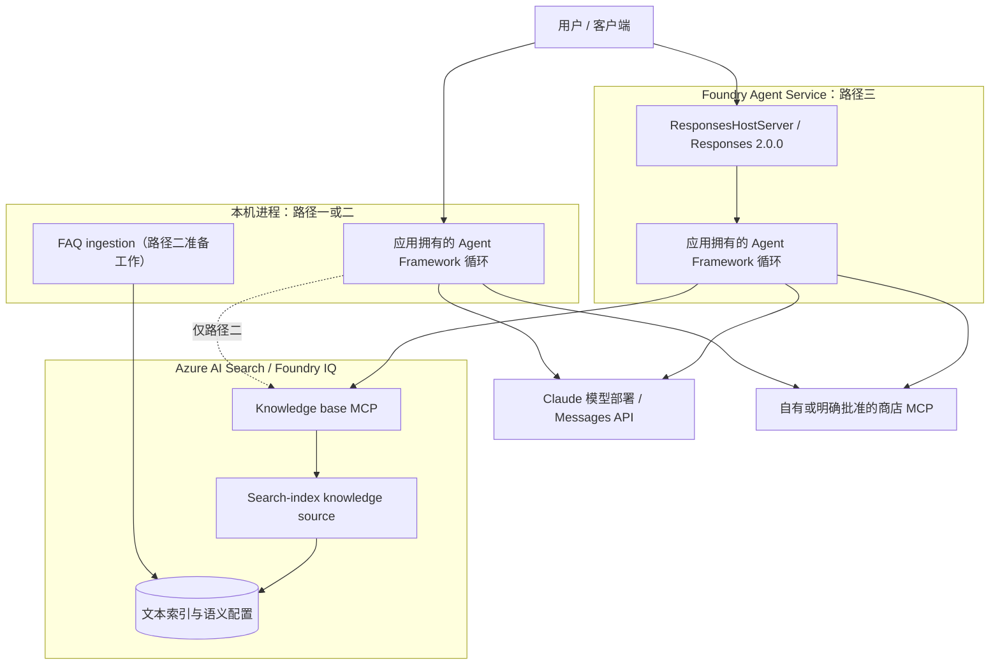

# Claude on Foundry Workshop：研究与实操指南

[English](claude-on-foundry-workshop-guide.en.md) | [仓库首页](README.md) | [既有 AOAI 手册（中文）](azure-foundry-aoai-guide.md)

> **范围与日期：**面向了解 Python、Azure 和基本 API 调用、希望理解 Agent 编排的开发者与架构师。本文是独立研究与操作说明，不是可执行项目，也不是已验证的部署手册。资料查阅日期：**2026-09-29**。
>
> **未实测：**本次仅阅读公开源码和官方文档；未安装示例依赖、运行上游程序、调用模型或 MCP、上传 FAQ、部署或修改 Azure 资源。所有“预期观察”和检查清单都供读者后续自行验证，不是本次测试结果。即使 Agent 在本机运行，它仍可能调用收费的云模型和远程工具。

## 导航

[1. 阅读说明与结论](#scope) · [2. 项目地图与架构](#architecture) · [3. 前置条件与配置](#prerequisites) · [4. 本地 Agent](#local) · [5. Foundry IQ](#iq) · [6. Hosted Agent](#hosted) · [7. 问题与适配](#issues) · [8. 生产与排障](#operations) · [9. 检查清单](#checklist) · [10. 来源与归属](#sources)

<a id="scope"></a>
## 1. 阅读说明与结论

研究对象是 Shilpa Jain 的 [Claude-on-foundry-handsonworkshop][S1]，固定提交为 **`4326fb9c76cdac1f1b6e7444151e32fa99ec2e6e`**（2026-09-16；2026-09-29 复查仍为上游 main HEAD）。下文的上游文件链接均固定到该提交；Microsoft Learn 链接是会更新的官方页面，不代表该提交当时的 SDK 契约。

| 证据标签 | 含义 |
| --- | --- |
| 源码确认 | 固定提交中的文件、配置或控制流程可直接支持该结论 |
| 官方文档 | 查阅日期当日的产品说明；实际订阅、区域、模型和版本仍需核对 |
| 适配建议 | 为读者后续改造提出的方案；本仓库没有修改或交付上游应用 |
| 未验证 | 安装、运行、身份授权、服务可达性、兼容性或云端结果均未实测 |

**核心结论：**

1. Claude 提供模型推理；`Agent`、会话与 MCP 调用循环属于应用拥有的 **Microsoft Agent Framework**。这不是 Claude Code，也不是 Claude Agent SDK 的编码代理运行时。[S2]、[D2]
2. 三条路径递进但不等同：本地工具 Agent → 增加 Foundry IQ 知识检索 → 用 Foundry Agent Service 托管同类编排代码。模型部署成功不等于 Agent 已部署。
3. FAQ ingestion 构建的是文本字段与语义配置，**没有向量字段、embedding 生成或向量检索配置**，不能把它描述为已实现的向量 RAG。[S4]
4. Claude 模型调用使用 **Messages API**；Hosted 示例对客户端暴露 **Responses 协议**。对外协议不改变内部模型 API。[S6]、[D1]、[D5]
5. 上游有路径、打包和版本边界问题。尤其是当前 provider 导入、Search API 和 azd 配置已与示例存在差异；**固定源码不等于锁定依赖，更不等于可直接复现**。

本指南不将所有能力统一标为 GA 或 Preview。例如当前官方将 Hosted Agents 托管服务标为 GA，但 Python `agent-framework-foundry-hosting` 集成仍是 prerelease；Search 的 GA 与 preview API 也有不同能力。[D3]、[D9]

<a id="architecture"></a>
## 2. 项目地图与架构

### 2.1 固定版本项目地图

这些路径位于**上游仓库**，不是本仓库新增的应用文件。

| 上游位置 | 作用与边界 |
| --- | --- |
| [README.md][S1]、[requirements.txt][S8] | 本地入门；声明 Python 3.10+，依赖未锁定 |
| [agent.py][S2] | Claude 客户端、显式 MCP 连接、获取 prompts、单会话交互循环 |
| 根目录 `env.template`、`env_template`、`env.txt` | 文件树存在这些名称，不存在 README 所写的 `.env.template`；本文未读取或复制其实际配置值 |
| [FoundryIQ/agent_IQ.py][S3] | 同时提供商店业务 MCP 与 KB MCP，按问题选择工具 |
| [FoundryIQ/ingest_foundry_iq.py][S4] | 分块、建索引、上传文档、建 knowledge source 和 knowledge base |
| [FoundryIQ/Store FAQ/cupcake-store-info.md][S5] | FAQ 实际位置；与脚本默认相对路径不同 |
| [FoundryIQ/requirements-ingest.txt][S9]、`FoundryIQ/env_template` | ingestion 的依赖声明与环境模板名称 |
| [hosted-cupcake-agent/README.md][S10]、[azure.yaml][S7] | Hosted 操作说明、服务声明、运行时与环境注入 |
| [hosted-cupcake-agent/src/cupcake-agent/main.py][S6] | `ResponsesHostServer` 包装应用 Agent |
| [hosted-cupcake-agent/src/cupcake-agent/requirements.txt][S11] | Hosted 依赖；同目录有 `env.template`、`env_template`、`env`，没有 `.env.template` |

固定文件树未包含商店 MCP 服务端实现、`.agentignore` 或 VS Code `launch.json`。上游文档中的 F5 和打包排除描述不能当作已交付能力。

### 2.2 Claude Workshop Architecture



### 2.3 图例

实线表示调用或数据依赖，虚线表示仅路径二启用的本地 KB 连接。分组区分进程/服务职责，不声称已配置 VNet、私有端点或数据驻留边界。图是源码关系的静态说明，不是运行追踪；本地与 Hosted 是可选运行位置。

### 2.4 关键关系

用户消息交给应用 Agent；应用向 Claude 请求推理，并通过 MCP 客户端执行选中的工具，将工具结果交回模型。根示例还从商店 MCP 获取 instructions 与 welcome banner，因此外部服务既接收工具参数，也能影响 Agent 行为。路径二/三改用代码中的 instructions，并增加 KB 工具。[S2]、[S3]、[S6]

Foundry IQ 是建立在 Azure AI Search 上的知识层。knowledge source 指向索引，knowledge base 组织检索；它不是本例的 Claude 模型部署。Hosted 服务托管代码与 Agent 端点，不会仅因为包了一层 `ResponsesHostServer` 就自动创建 FAQ 索引、KB 或商店后端。[D3]、[D5]

<a id="prerequisites"></a>
## 3. 前置条件与配置矩阵

### 3.1 先核对 Claude 的独立准入条件

按 [Claude 官方部署说明][D1]，需要有效付费方式、受支持账单国家/地区、可部署区域中的 Foundry 项目，以及订阅模型 Marketplace offer 的权限。当前列出的不支持情形包括：**CSP 订阅、位于韩国的 Enterprise Accounts、没有有效按量付费方式的学生/试用/创业额度账号，以及仅使用 Azure credits 的 sponsored 订阅**；有信用卡的相应账号可能改为向信用卡收费。不能将既有 AOAI 手册中的 PAYG / EA / CSP 泛化说明作为 Claude 的支持承诺。

部署时在模型卡核对具体模型、版本、区域范围和条款。官方区分 **Hosted on Azure（版本 2）** 与 **Hosted on Anthropic infrastructure（版本 1）**，并按模型/版本列出 Global Standard、Data Zone 等可用选项；不要据此推断所有版本都有相同驻留、认证或功能。部分 Claude 模型仅支持 Entra ID，所以上游的 API-key-only 构造方式不是通用方案。[D1]

### 3.2 端点不是同一个地址

| 对象 | 占位符/形式 | 用途 |
| --- | --- | --- |
| Foundry 资源 | `<resource>`，以及对应 Azure Resource ID | Azure 资源、IAM、配额与计费上下文；不是聊天 URL |
| Foundry 项目端点 | `https://<resource>.services.ai.azure.com/api/projects/<project>` | 项目/Agent 管理；不要填进 Claude `base_url` |
| Claude 模型 base URL | `https://<resource>.services.ai.azure.com/anthropic` | 本例 `FOUNDRY_ENDPOINT` 的语义；从模型部署详情核对 |
| Claude Messages 请求地址 | 上述 base URL 加 `/v1/messages` | SDK 使用 base URL 构造请求；不要将完整请求地址再当 base URL |
| 模型部署名 | `<claude-deployment-name>` | 传给 `model`；可与模型目录 ID 不同，不是项目名或 Agent 名 |
| Search 服务端点 | `https://<search-service>.search.windows.net` | 索引/KB 所在服务，不是 Foundry 模型端点 |
| KB MCP 地址 | `https://<search-service>.search.windows.net/knowledgebases/<kb-name>/mcp?api-version=2026-05-01-preview` | **上游固定版本**构造的地址；不是本文认可的通用最新 API 版本 |
| Hosted Agent Responses 地址 | `<project-endpoint>/agents/<agent-name>/endpoint/protocols/openai/responses` | 当前官方的 Agent 调用形式；优先使用部署输出的实际协议端点 |
| 商店 MCP | `https://<your-approved-mcp-host>/mcp/` | 自有/获准服务；本文不提供也不探测作者的外部地址 |

模型端点依据 Claude 专页。[D1] 当前 provider 文档的 generic `AnthropicClient` 示例还出现 `/models/anthropic`；本文**不将其与 `/anthropic` 视为可互换**，应按实际模型部署详情和选定客户端核对。[D2] Agent 端点依据 Hosted 文档。[D5]

### 3.3 身份与最小权限

| 操作 | 上游行为 | 官方要求或后续适配方向 |
| --- | --- | --- |
| 创建 Claude 部署/订阅 offer | 示例假设已完成 | 资源组 Contributor / Owner 与 Marketplace 订阅权限；这是部署权限，不应授给普通推理进程。[D1] |
| Claude 推理 | 三个 Agent 都显式传 `api_key` | 对支持 key 的模型使用其对应 key；Entra 示例使用 `https://ai.azure.com/.default`，Claude 排障页列出 **Cognitive Services User**。不要直接套用 AOAI 专用角色。[D1] |
| Search 建索引、knowledge source、KB | ingestion 有 key 时用 `AzureKeyCredential`，否则 `DefaultAzureCredential` | admin key，或启用 Search RBAC 后用 **Search Service Contributor** 管理对象。[S4]、[D3]、[D10] |
| Search 上传文档 | ingestion 使用同一 credential | Entra 还需要 **Search Index Data Contributor**；能建索引不等于能写文档。[D10] |
| KB MCP 查询 | IQ/Hosted 必须提供 `AZURE_SEARCH_API_KEY`，通过 `header_provider` 放入 `api-key` | MCP 专节列出 **bearer token（推荐）或 admin key**；Entra 查询使用 **Search Index Data Reader**，token scope 为 `https://search.azure.com/.default`。不要把普通 retrieve/query API 的 query-key 说明直接搬到 MCP。[D4] |
| Hosted 部署与运行 | 上游代码仍使用模型/Search keys | 当前部署文档要求项目范围 **Foundry Project Manager**（旧名 Azure AI Project Manager）。部署者、平台 Agent identity、项目 managed identity 是不同主体；托管不会自动把显式 key 代码改成无密钥。[D5]、[D6] |

生产建议将 ingestion 写权限与 Agent 查询权限分开。迁移到 Entra 时，需要在应用中实现正确客户端认证、token 刷新与 MCP headers，不是删除 `.env` 中的 key 就能完成。只有 ingestion 有 credential fallback；IQ/Hosted 当前没有 Search bearer-token 分支。[S3]、[S4]、[S6]

### 3.4 上游环境变量映射

以下名称描述固定源码；值全部使用占位符，不复制上游环境文件。

| 变量 | 本地路径一 | IQ 路径二 | Hosted 路径三 | 值/注意事项 |
| --- | --- | --- | --- | --- |
| `FOUNDRY_MODEL_DEPLOYMENT` | 必需 | 必需 | 必需 | `<claude-deployment-name>` |
| `FOUNDRY_API_KEY` | 必需 | 必需 | 必需 | `<foundry-api-key>`；仅适用于允许 key 的模型 |
| `FOUNDRY_ENDPOINT` | 必需 | 必需 | 必需 | Claude base URL，不是项目端点 |
| `AZURE_SEARCH_ENDPOINT` | 不使用 | ingestion/Agent 必需 | 必需 | Search 服务端点 |
| `AZURE_SEARCH_API_KEY` | 不使用 | ingestion 可省略转 Entra；Agent 必需 | 必需 | 见上表 MCP 的 admin-key 与 bearer-token 边界 |
| `KNOWLEDGE_BASE_NAME` | 不使用 | Agent 可选 | 可选 | 默认 `cupcake-store-kb`；ingestion 使用同名**代码常量**，不会读取此变量 |
| `CUPCAKE_MCP_URL` | **不读取**，URL 硬编码 | 可选，但应明确覆盖 | 可选，但应明确覆盖 | `<your-approved-mcp-url>`；IQ/Hosted 默认仍指向作者的服务 |

**Hosted 当前版本迁移门槛：**[当前 azd YAML 参考][D7] 使用 `env` map，且保留 `FOUNDRY_` / `AGENT_` 前缀；上游却以 `environmentVariables` 注入自定义 `FOUNDRY_*` 值。使用当前工具链时，应在读者自己的副本中一致重命名，例如 `FOUNDRY_MODEL_DEPLOYMENT` → `APP_CLAUDE_DEPLOYMENT`、`FOUNDRY_API_KEY` → `APP_CLAUDE_API_KEY`、`FOUNDRY_ENDPOINT` → `APP_CLAUDE_BASE_URL`，同时修改 Python 读取、YAML 映射和 azd 环境配置。不要覆盖平台注入的 `FOUNDRY_PROJECT_ENDPOINT`。这些是待验证迁移建议，不是已执行补丁；上表保留原名以便读源码。

### 3.5 运行时与依赖版本边界

| 路径/组件 | 固定上游 | 当前官方对照与要求 |
| --- | --- | --- |
| 本地根示例 | README：Python 3.10+；`agent-framework`、`agent-framework-foundry`、`agent-framework-foundry-hosting`、`azure-identity`、`python-dotenv` 均未锁定 | 声明的 Python 下限不是当前所有依赖的兼容性证明。[S1]、[S8] |
| Anthropic provider | 三处从 `agent_framework.foundry` 导入 `AnthropicFoundryClient` | 当前 Python 文档列出 `agent-framework-anthropic`，从 `agent_framework.anthropic` 导入。根 requirements 未显式列该包，Hosted 已列；不能断言旧导入在每个版本都失效。[D2] |
| 原生模型 SDK | 上游经 Framework 封装 | Claude 官方原生 Python 示例为 `from anthropic import AnthropicFoundry`；不要与 Framework 的 `AnthropicFoundryClient` 混淆。[D1] |
| IQ ingestion | `azure-search-documents`、`azure-identity` 未锁定；脚本也导入 `dotenv` | 单独安装 ingestion requirements 不覆盖 `python-dotenv`；需根依赖或在自己的环境中补齐。SDK 必须包含脚本用到的 KB 类型。[S4]、[S9] |
| Search API | KB MCP 固定 `2026-05-01-preview`；ingestion 未显式设置 SDK API 版本 | 当前文档：`2026-04-01` 为 GA 最小 extractive 路径，`2026-08-01-preview` 提供相应 preview 能力。分别核对创建、检索、MCP 和 SDK；**不要全局替换版本字符串**。[D3]、[D4] |
| Hosted | `python_3_13`、`main.py`、`remote_build`、Responses `2.0.0`；hosting 包 `>=1.0.0a260630` | 下界不是锁文件。当前官方确认 `ResponsesHostServer`，但 hosting Python 集成仍 prerelease。[S7]、[S11]、[D9] |
| azd 扩展 | 只要求 `azure.ai.agents >=1.0.0-beta.4` | 当前 YAML 文档要求 `azure.ai.agents >=1.0.0-beta.8` 与 `azure.ai.projects >=1.0.0-beta.4`；本指南不声称这个新组合已兼容上游 YAML。[D7] |

本指南没有提供“测试通过的版本组合”。读者应先选择保留历史 API 还是迁移当前 API，在独立环境检查包元数据、导入、schema 和依赖冲突，再记录实际版本；不要将全部安装成 latest 当作修复方案。

<a id="local"></a>
## 4. 路径一：本地 Claude + MCP Agent

**目标：**理解一个应用进程如何让 Claude 推理并使用商店工具。前提是自有模型部署、合适身份和已经审查过的自有 MCP 服务；仅有模型 key 不足以运行完整示例。

### 4.1 获取并审查固定源码

在本仓库之外的独立实验目录获取上游，以下为**供读者执行的说明，本文未执行**：

```powershell
git clone https://github.com/ShilJain/Claude-on-foundry-handsonworkshop.git
Set-Location .\Claude-on-foundry-handsonworkshop
git checkout --detach 4326fb9c76cdac1f1b6e7444151e32fa99ec2e6e
```

先阅读 [agent.py][S2] 与 [requirements.txt][S8]，处理第 3.5 节的 provider/依赖差异，并在自己的副本中移除无用的独立 `exit` 表达式。它不是 `exit()`，通常不会退出程序；在不提供该交互辅助名称的环境中还可能报错。

### 4.2 准备配置与获准服务

根目录真实模板名是 `env.template`，不是 `.env.template`。建议依据第 3.4 节**新建自己的**本地 `.env`，只填自己的部署值；不要复用任何上游账号、key 或地址，并自行设置 Git 与打包排除规则。

根 `agent.py` **不会读取 `CUPCAKE_MCP_URL`**。在自己的副本中将硬编码 URL 改为自有/获准服务，或先增加显式环境读取与缺失值报错。服务必须提供样例要调用的 `agent_instructions`、`welcome_banner` prompts 和经审查的业务 tools；仓库没有其服务端实现，不能承诺工具名称、参数或可用性。

不要为查看欢迎信息而连接作者服务：`connect()` / `get_prompt()` 本身就会发生远程交互。检查外部 instructions 的信任级别，并将最终系统策略保留在应用控制下。

### 4.3 准备独立环境并启动

完成版本选择与上述适配后，在上游根目录创建虚拟环境、安装**已审查的**依赖。例如：

```powershell
python -m venv .venv
.\.venv\Scripts\python.exe -m pip install -r .\requirements.txt
.\.venv\Scripts\python.exe .\agent.py
```

这组命令不是未经修改源码的可复现保证；原 requirements 未锁定，也未显式声明当前 Anthropic provider。不要在导入失败后反复盲装版本。启动即会连接 MCP 并自动向 Agent 发送 `hello`，可能产生模型和工具调用。

### 4.4 观察并安全结束

源码顺序是：加载 `.env` → 建 Claude client → MCP `connect()` → 两次 `get_prompt()` → 创建 `Agent` → `create_session()` → 自动问候 → 在同一 session 反复 `agent.run()`。预期看到服务提供的 banner、模型回复与交互提示；先问只读的库存/商品问题，并用工具追踪确认发生了预期调用，而非仅凭自然语言回答判定成功。

根样例仅在正常退出循环后 `close()`；异常、取消和 Ctrl+C 不保证执行关闭。读者应采用所选 SDK 支持的上下文管理或 `try/finally` 处理连接生命周期，再分别验证 `exit` / `quit`、异常和中断。不要在没有审批/幂等控制的系统上试下单。

<a id="iq"></a>
## 5. 路径二：加入 Foundry IQ

**目标：**商店业务动作走商店 MCP，营业时间、配送和退货等政策走 KB MCP。前提是在路径一边界已明确的基础上，拥有支持所需能力的 Azure AI Search 服务、语义检索配置和独立 ingestion/查询权限。[S3]、[D3]

### 5.1 对齐文档路径和命名

FAQ 位于 `FoundryIQ\Store FAQ\cupcake-store-info.md`；脚本的 `DOCUMENT_PATH = "cupcake-store-info.md"` 相对于**当前工作目录**，不是脚本目录。两种可选适配：

| 方式 | 操作 | 边界 |
| --- | --- | --- |
| 保持原路径常量 | 在 `FoundryIQ\Store FAQ` 下运行 `..\ingest_foundry_iq.py` | 后面的示例命令采用此方式；依赖已安装，且进程环境/本地 `.env` 可被脚本读取 |
| 改为明确路径 | 在自己的副本中以脚本目录为基准定位 `Store FAQ\cupcake-store-info.md` | 需要修改应用并自行验证；仅换到 `FoundryIQ` 目录并不能修复原常量 |

默认对象名为 `cupcake-store-index`、`cupcake-semantic`、`cupcake-store-ks`、`cupcake-store-kb`。ingestion 中都是代码常量。若使用自己的名称，必须同步索引、knowledge source、KB 和 Agent 的 `KNOWLEDGE_BASE_NAME`；不要覆盖共享服务里的同名对象。

### 5.2 理解 ingestion 实际做了什么

脚本按 Markdown 二级标题边界分块（开头非空内容也可能成为一块），将字符串字段 `id`、`title`、`category`、`content` 上传到索引；语义配置使用标题、类别与正文。然后创建 search-index knowledge source，并让 KB 引用该 source。[S4]

**没有 embedding 调用或向量字段，也没有给 KB 配置 LLM。** 不能据此声称 KB 创建必然失败：当前官方 `2026-04-01` 支持无 LLM 的最小 extractive 检索；`2026-08-01-preview` 的非 web sources 可选 LLM，web source 才有相应必需条件。若以后启用 KB 查询规划/答案合成，应独立配置受支持的模型、Search 服务身份与模型访问权限；它不自动复用 Agent 的 Claude client。[D3]

这些当前规则不证明上游未锁定 SDK 与 `2026-05-01-preview` 的组合已兼容。先核对选定版本的 `KnowledgeBase`、knowledge source schema、默认检索行为和 MCP 工具 schema。

### 5.3 上传前审查，再执行 ingestion

仅在读者自己的实验资源中执行。审查 FAQ 的数据授权与内容、确认每次 `create_or_update_*` 的影响、配好第 3.3 节权限，并在实验环境中安装根依赖及经过版本审查的 ingestion 依赖。`requirements-ingest.txt` 本身不包含 `python-dotenv`。

下面从**上游根目录**出发，假定沿用第 4 节的 `.venv`：

```powershell
.\.venv\Scripts\python.exe -m pip install -r .\FoundryIQ\requirements-ingest.txt
Push-Location '.\FoundryIQ\Store FAQ'
try {
    ..\..\.venv\Scripts\python.exe ..\ingest_foundry_iq.py
} finally {
    Pop-Location
}
```

这些命令会创建/更新 Search 对象并上传内容；本文没有执行。预期先看到分块数，随后是索引、上传、source 与 KB 的日志。**日志“ready”不等于验收通过**：脚本只统计 `succeeded`，即使部分上传失败也继续。应检查每一项上传结果、失败原因、实际文档数与 KB 检索结果；失败时停止后续步骤，不把缺失内容的回答当作有效结果。

### 5.4 接入 KB MCP

从上游根目录运行 `.\.venv\Scripts\python.exe .\FoundryIQ\agent_IQ.py` 前，设置自己的 Search endpoint、认证、KB 名与商店 MCP URL。Agent 拼接的固定 KB URL 见第 3.2 节；通过 `header_provider` 注入 `api-key`，`load_prompts=False` 仅关闭 KB prompt 加载，不会关闭 KB tools 或跳过认证。[S3]

KB 官方提供 `knowledge_base_retrieve` 工具。应用直接连接 Search MCP，不需要再套一层 Azure OpenAI Responses 调用；官方页面中的 Responses 示例是一种 MCP 客户端示例，不是本例必须换模型的理由。[D4]

当前 IQ 代码不像根样例那样显式 `connect()` / `close()`；不要未经版本验证就认定是 bug 或自动连接一定可用。按选定 Framework 版本确认工具初始化、生命周期、异常清理与 headers 刷新。

### 5.5 用可区分的任务验证

预期“退货政策是什么？”触发 KB 检索，“有哪些现货？”触发商店工具；回答须能追溯到实际文档或工具结果。另测文档没有答案、KB 无权限和工具断连，确保不会编造政策或订单成功状态。自然语言说明“我查询了知识库”不是调用证据，需要日志/trace 与源文档对照。

检索获得的数据可能被交给 Claude 生成最终回答。这个 FAQ 索引没有文档 ACL 或用户身份过滤配置，不能因为 Foundry IQ 产品支持 permission-aware retrieval 就宣称该样例已实现逐用户权限隔离。[S4]、[D4]

<a id="hosted"></a>
## 6. 路径三：Hosted Agent

**目标：**将应用编排作为 Foundry Agent Service 中的服务提供给客户端，而不是改变 Claude 模型协议。路径二的模型、Search 对象与获准商店 MCP 仍是下游依赖。

### 6.1 先读打包边界

项目目录为 `hosted-cupcake-agent`，服务源码目录为 `src\cupcake-agent`。[S7] 固定 YAML 声明 `host: azure.ai.agent`、`kind: hosted`、`language: python`、`codeConfiguration.runtime: python_3_13`、`entryPoint: main.py`、`dependencyResolution: remote_build`、Responses `2.0.0`，以及 1 CPU / 2Gi 内存。

`main.py` 通过 `require_setting()` 检查五个必需值（模型三项和 Search 两项），建立两个 MCP tools，再调用 `ResponsesHostServer(create_agent()).run()`。[S6] 当前官方说明 `remote_build` 是上传源代码 ZIP 后由平台解析依赖，不要求读者自行提供 Dockerfile；不要把通用的镜像/ACR 操作机械加入该路径。[D6]、[D9]

### 6.2 在本地运行前完成迁移检查

1. 使用与 YAML 对齐的 Python 3.13 独立环境；审查 Hosted requirements 的 prerelease 下界、provider 导入与实际解析版本。
2. Hosted README 提到 `src/cupcake-agent/.env.template`，实际为 `src/cupcake-agent/env.template`。按配置矩阵建立自己的环境，不复制上游值。
3. 按第 3.4 节处理保留前缀和 `environmentVariables` → 当前 `env` schema 的差异；同步 Python、YAML 与 azd 环境，不只改一个文件。当前文档也以 `startupCommand` 控制本地启动，应核对其与 `codeConfiguration.entryPoint` 的分工。[D7]、[D8]
4. 当前 azd 将 Agent 与项目/infrastructure 支持分到两个扩展，按第 3.5 节及官方安装链接准备；上游的扩展最低版本不足以说明当前 `microsoft.foundry` provider 已就绪。
5. 明确要使用的租户、订阅、项目和 azd 环境。CLI 登录用于部署/工具身份，不代替应用的模型与 Search 认证。替换商店 MCP 默认地址，确认云端运行位置也能访问各下游。
6. **部署前阻断项：**上游没有承诺的 `.agentignore` 或 VS Code launch 配置。使用所选工具链支持的排除机制，检查实际打包文件清单，排除 `.env`、`.azure`、虚拟环境、日志以及 `env` / `env_template` 等可能承载配置的文件。Git 忽略规则不等于 ZIP 排除规则；不要在包内容未经检查时部署。

### 6.3 本地 host 与本地客户端

在配置/依赖/下游均已就绪的前提下，从上游 `hosted-cupcake-agent` 目录操作。上游 README 给出的顺序是 `azd ai agent run --no-client`，再在另一个终端用 `azd ai agent invoke cupcake-agent --local "hello, are you up?"`。[S10]

[当前官方本地运行文档][D8] 的基础命令如下；这不是已运行记录：

```powershell
azd ai agent run
```

另开终端，进入同一项目目录与正确 azd 环境：

```powershell
azd ai agent invoke --local "Hello, what can you do?"
```

先用所选扩展的帮助确认 `--no-client`、service-name 和启动命令选项是否适用。当前文档默认端口为 `localhost:8088`，`run` 可能安装依赖。**`--local` 只表示 Agent host 在本机**；并不会把 Claude、Search 或 MCP 变成本地服务，也不保证离线、免费或不产生副作用。

预期本地 host 启动后，客户端收到符合 Responses 的回复，且工具 trace 显示正确下游。验证同一会话的连续对话与不同会话隔离；不要把进程内测试直接当作托管后持久性已验证。

### 6.4 有条件的部署流程

以下仅说明读者后续操作；需要获准的资源、费用与权限，以及已通过的本地验证。

| 阶段 | 操作与预期观察 |
| --- | --- |
| 首次准备 | 按 [source-code 部署指南][D6] 和其 quickstart 初始化/关联正确项目，检查已有 YAML 而不是盲目重生成。官方 `azd up` 包含 provision 与 deploy，可能创建资源、角色与费用；只在审查目标和变更后使用。 |
| 已有资源、仅部署代码 | 上游列出 `azd deploy cupcake-agent --no-prompt`；交互式检查更适合首次实验，不应在目标不明时使用 `--no-prompt`。先确认当前环境已 provision/关联、schema 已适配、运行时值已注入。 |
| 检查结果 | 使用 `azd ai agent show` 取得 Agent 名、版本、协议与端点；等待版本达到 `active`。不要把命令返回或版本被创建当作下游可用证据。 |
| 云端调用 | 使用所选工具链支持的 invoke 命令调用自己的 Agent 协议端点，先做只读任务；分别确认模型、KB 和商店 MCP。去掉 `--local` 会跨入云端调用边界。 |
| 运维交接 | 记录版本、实际依赖、权限、预算、责任人和清理清单；仅保留脱敏结果。 |

上游 `.env` 不会自动成为部署环境。当前文档支持通过 azd 环境占位符或 Foundry connection 注入运行时配置；connection 的解析方式须与所选工具链匹配。[D7]、[D8] 平台提供 Agent identity 也不代表当前显式 key 的 Claude/Search client 已改用它。

<a id="issues"></a>
## 7. 上游问题与适配建议

这里是静态一致性与版本风险清单，不是已复现的运行故障或完整安全审计。**所有建议修复均未在本次安装、运行或云端测试。**

| ID | 来源与发现 | 影响 | 建议适配 | 验证状态 |
| --- | --- | --- | --- | --- |
| W01 | [根 README][S1]、[Hosted README][S10] 的 `.env.template` 不在对应固定目录，实际为 `env.template` 等 | 按文档复制会找不到文件；可能误用他人配置 | 依据真实位置新建自己的配置；不复制上游值 | 文件树/文档确认；运行未验证 |
| W02 | [根 agent.py][S2] 有独立 `exit` 表达式 | 不是退出调用；部分 Python 启动模式可能没有该名称 | 删除无用表达式 | 源码确认；不同启动模式未测试 |
| W03 | [根 Agent][S2] 正常路径才 close；[IQ][S3]/[Hosted][S6] 无显式工具连接/清理 | 异常资源释放与自动连接依赖 SDK 契约 | 确认当前工具生命周期，增加适当上下文/取消清理 | 源码确认；并非判定所有版本必坏 |
| W04 | 三个 Agent 导入 `agent_framework.foundry.AnthropicFoundryClient`，当前 [provider 文档][D2] 为 `agent_framework.anthropic` | 未锁定安装可能出现导入/行为差异 | 对齐 provider 包、导入、参数与实测版本 | 源码/官方差异确认；兼容组合未知 |
| W05 | [ingestion][S4] 文档相对路径与 [FAQ][S5] 位置不同 | 从常见目录运行找不到文档 | 指定正确工作目录或以脚本目录构造路径 | 静态确认；未上传 |
| W06 | [ingestion][S4] 只打印上传成功数并继续建 KB | 部分失败也可能输出“ready” | 逐项检查并停止失败流程，验证文档数和检索 | 控制流程确认；未注入故障 |
| W07 | [IQ][S3]/[Hosted][S6] 固定 `2026-05-01-preview`，ingestion SDK 未锁定 | 创建与 MCP 查询可能使用不同契约 | 分操作核对 SDK、schema 与 [GA/preview 差异][D3]，不机械换版本 | 版本声明确认；服务兼容性未知 |
| W08 | 根 URL 硬编码；IQ/Hosted 默认同一外部 MCP；无服务端源码 | 不可自包含复现，存在可用性和数据出境风险 | 根代码改 URL/显式配置；其余覆盖变量；只接自有/获准服务 | 源码确认；外部服务**未探测** |
| W09 | [Hosted README][S10] 声称 `.agentignore` 与调试配置，但固定树没有 | 无法保证打包排除或 F5 启动 | 检查工具支持的忽略机制、实际 ZIP 清单及启动设置 | 文件树确认；未打包 |
| W10 | [requirements][S8]/[ingestion requirements][S9]/[Hosted requirements][S11] 未锁定或仅下界；ingestion 缺少直接 dotenv 声明 | 今天安装的环境可能不同，独立 ingestion 环境缺依赖 | 在各路径独立环境解析、核验并记录版本与直接依赖 | 声明确认；未安装 |
| W11 | [YAML][S7] 的旧扩展下界、`environmentVariables` 与自定义 `FOUNDRY_*` 对照 [当前规范][D7] 有差异 | 当前部署/环境注入不能假定兼容 | 对齐扩展、env map、保留前缀及启动配置，并验证打包与运行 | 官方/源码差异确认；未部署 |
| W12 | [IQ][S3]/[Hosted][S6] 将 Search key 用于 MCP，未实现 bearer token | admin key 权限过大；换成普通 query key 不能假定工作 | 按 [MCP 认证专节][D4] 适配可刷新的 bearer token 与查询 RBAC | 源码/官方确认；授权未验证 |
| W13 | [ingestion][S4] 名称为常量，Agent KB 名来自环境 | 单改 `KNOWLEDGE_BASE_NAME` 可能查询不存在的 KB | 同步生产端/消费端命名，避免覆盖共享对象 | 源码确认；资源未检查 |

<a id="operations"></a>
## 8. 生产使用、排障与清理

### 8.1 生产化不是“部署成功”的同义词

| 主题 | 应落实的控制 |
| --- | --- |
| 第三方数据边界 | 逐条记录用户消息、工具参数、检索片段、模型结果和日志的接收方；审核 MCP operator、模型托管版本、保留/共享/地域条款。外部返回内容与 prompts 均是不可信输入。 |
| 密钥与身份 | 不将 key 写入代码、文档、截图、命令历史、Git 或部署包；使用适当 secret store/connection，验证轮换与吊销。Entra 优先，但必须真正修改认证实现和最小权限。 |
| 工具副作用 | 下单、取消、退款等动作必须有应用侧授权与人类确认、参数验证、幂等键和审计；不要仅靠模型 instructions。只读测试不能证明写操作安全。 |
| 内容与访问 | FAQ/检索结果做来源核验、缺失信息拒答和注入防护；有租户/文档权限需求时另行实现与测试，不把公用 Search key 等同逐用户授权。 |
| 可靠性 | 限制循环、token、超时与重试；对写操作避免无条件重试；明确工具不可用/部分检索失败，不输出虚假的成功状态。验证取消、连接回收、会话隔离和持久性。 |
| 监控 | 记录关联 ID、实际工具调用、延迟、限流与用量；对 prompts、订单、文档和认证 headers 脱敏，限制 trace 访问与保留。 |
| 费用 | 分开预算 Claude tokens、Search 容量/语义或 agentic 检索、可选 KB LLM、Hosted 运行时、监控/存储及自建 MCP 后端。源码部署和 `--local` 都不等于零费用；按当前服务定价与账单验证。 |

Hosted 文档明确：接入第三方系统的数据、成本、权限、地域与应用安全决策仍由使用者负责。平台托管不是对该示例生产就绪或合规性的背书。[D5]

### 8.2 排障时按边界定位

| 现象 | 优先检查 |
| --- | --- |
| `ImportError` / 缺少 `AnthropicFoundryClient` 或 KB 类型 | 实际 Python/SDK 版本、provider 导入路径、Search stable/preview 类型；不要先换 endpoint |
| 模板或 FAQ `FileNotFoundError` | 真实文件名、当前工作目录和 `DOCUMENT_PATH`；分别参照路径一、二、三 |
| Claude 401 / 403 | 模型是否支持 key；key 与资源是否对应；Entra scope `https://ai.azure.com/.default`、Cognitive Services User、租户和网络限制 |
| Claude 404 / deployment not found | `/anthropic` base URL 与完整 Messages URL 是否混用；部署名是否误写为模型 ID/Agent 名 |
| KB MCP 401 / 403 | 是否把 query key 当 MCP admin key；bearer token 是否过期、scope 是否为 Search；Search RBAC 与网络是否正确 |
| KB 400 / schema 或 API version 错误 | 创建端 SDK 与 MCP API 的契约、KB 配置、所选 API 的 LLM/检索模式，不要一次改掉全部版本 |
| KB 空结果、缺片段或无根据回答 | FAQ 路径、每项上传状态、实际文档数、semantic config、knowledge source/KB 名和检索输出；检查是否真的调用工具 |
| MCP 连接或 prompt 错误 | 自有服务可达性、认证、Streamable HTTP 与 prompt/tool 能力；根样例两个 prompt 的名称是否提供 |
| 本地 Hosted 端口拒绝连接 | host 是否启动、端口占用、启动命令与当前 azd 环境；不应先重新部署云资源 |
| Hosted 构建/启动失败 | ZIP 根布局、依赖解析、Python 3.13、env schema/保留前缀和必需值；版本 `failed` 先读 error，启动后再检查运行日志 |
| 429 / 超时 / 费用异常 | 具体模型或 Search/工具的配额、重试次数、循环长度、并发与 token 限额 |

只保留脱敏错误、时间、请求 ID 和版本信息供排查；不要把认证 headers 或完整客户文档贴到公共 issue。

### 8.3 由实验资源所有者完成清理

结束实验时，先列出**这次实验确实创建**的 Agent 名/版本、模型部署、KB、knowledge source、索引、监控/存储和 MCP 后端，并确认是否共享。停止不再需要的会话/应用，按依赖关系清理自有 KB、source 与索引；随后按各服务正式流程处理专用部署、Agent 版本及其他专用资源。保留业务需要的资料后再删，不能按示例名称盲删。

撤销临时角色，吊销/轮换可能暴露的 key，清理本地 secrets、部署包与敏感日志；最后核对账单和剩余资源。删除一个 Agent 不代表 Search、模型、日志或第三方服务已停止计费。本指南不提供批量删除资源组或广泛破坏性清理命令。

<a id="checklist"></a>
## 9. 读者自行验证的检查清单

**以下均未由本次研究执行；未勾选不表示失败，而表示没有实测证据。**

- [ ] 已确认 Claude 订阅、Marketplace、模型/托管版本、区域、认证与部署名。
- [ ] 已记录每条路径的 Python、包、SDK API 与 azd 扩展版本；不存在未解释的导入/schema 差异。
- [ ] 所有端点属于自己或获得明确批准；根硬编码和 IQ/Hosted 默认第三方 MCP 已替换。
- [ ] 本地 Agent 成功完成模型调用、真实只读工具调用、同会话续聊及中断/异常清理。
- [ ] ingestion 使用正确 FAQ；所有上传项成功，文档数、索引/source/KB 名一致。
- [ ] 已分别验证 KB MCP 认证、可追溯回答、缺失答案与无权限场景，没有误称向量 RAG 或逐用户 ACL。
- [ ] Hosted 当前 schema、保留前缀、启动方式、依赖和实际打包排除均通过检查。
- [ ] 本地 Responses host 与云端 Agent 被分别验证；云端版本 `active` 且下游调用、会话隔离均符合预期。
- [ ] 写操作有独立审批/幂等策略；预算、脱敏日志、告警与资源清理责任人已落实。

<a id="sources"></a>
## 10. 来源、许可证与归属

本指南是对上游架构、实现和官方资料的原创综合整理，不是原 README 的逐段翻译或整库复制。已核对 [上游 LICENSE][S12]：**MIT License，Copyright (c) 2026 Shilpa Jain**。如在自己的应用中复制或改编其代码/实质性部分，须随副本保留版权与 MIT 许可声明及免责声明；许可证不授予其外部 MCP 服务的访问权或数据使用许可。

本文的少量操作命令用于说明读者流程；未重新分发上游 Python 实现或环境文件。文档由 AI 辅助整理，发布、部署和产品选型前仍需由维护者审阅，尤其是随时间变化的能力与权限说明。

### 10.1 固定上游来源

| 标记 | 来源 |
| --- | --- |
| S1–S4 | [根 README][S1]、[本地 Agent][S2]、[IQ Agent][S3]、[ingestion][S4] |
| S5–S7 | [FAQ][S5]、[Hosted main.py][S6]、[Hosted azure.yaml][S7] |
| S8–S12 | [根依赖][S8]、[ingestion 依赖][S9]、[Hosted README][S10]、[Hosted 依赖][S11]、[MIT LICENSE][S12] |

### 10.2 官方资料（查阅于 2026-09-29）

| 标记 | 资料与用途 |
| --- | --- |
| D1 | [部署与使用 Claude][D1]：订阅、Marketplace、托管版本、Messages API、认证 |
| D2 | [Agent Framework Anthropic provider][D2]：包、导入、client 与应用拥有的循环 |
| D3 | [创建 Search knowledge base][D3]：GA/preview、可选 LLM、创建权限 |
| D4 | [retrieve 与 KB MCP][D4]：MCP URL、认证、检索输出和权限边界 |
| D5 | [Hosted Agents 概念][D5]：托管、协议、Agent identity、第三方责任 |
| D6 | [从源代码部署 Hosted Agent][D6]：ZIP、runtime、remote_build、部署权限 |
| D7 | [Hosted azure.yaml 参考][D7]：扩展、env、保留前缀与协议端点 |
| D8 | [使用 azd 本地运行 Hosted Agent][D8]：本地 host、invoke、环境注入 |
| D9 | [Agent Framework Foundry Hosting][D9]：ResponsesHostServer、服务与集成包发布状态 |
| D10 | [Search RBAC][D10]：对象管理、写入与查询的权限分工 |

[S1]: https://github.com/ShilJain/Claude-on-foundry-handsonworkshop/blob/4326fb9c76cdac1f1b6e7444151e32fa99ec2e6e/README.md
[S2]: https://github.com/ShilJain/Claude-on-foundry-handsonworkshop/blob/4326fb9c76cdac1f1b6e7444151e32fa99ec2e6e/agent.py
[S3]: https://github.com/ShilJain/Claude-on-foundry-handsonworkshop/blob/4326fb9c76cdac1f1b6e7444151e32fa99ec2e6e/FoundryIQ/agent_IQ.py
[S4]: https://github.com/ShilJain/Claude-on-foundry-handsonworkshop/blob/4326fb9c76cdac1f1b6e7444151e32fa99ec2e6e/FoundryIQ/ingest_foundry_iq.py
[S5]: https://github.com/ShilJain/Claude-on-foundry-handsonworkshop/blob/4326fb9c76cdac1f1b6e7444151e32fa99ec2e6e/FoundryIQ/Store%20FAQ/cupcake-store-info.md
[S6]: https://github.com/ShilJain/Claude-on-foundry-handsonworkshop/blob/4326fb9c76cdac1f1b6e7444151e32fa99ec2e6e/hosted-cupcake-agent/src/cupcake-agent/main.py
[S7]: https://github.com/ShilJain/Claude-on-foundry-handsonworkshop/blob/4326fb9c76cdac1f1b6e7444151e32fa99ec2e6e/hosted-cupcake-agent/azure.yaml
[S8]: https://github.com/ShilJain/Claude-on-foundry-handsonworkshop/blob/4326fb9c76cdac1f1b6e7444151e32fa99ec2e6e/requirements.txt
[S9]: https://github.com/ShilJain/Claude-on-foundry-handsonworkshop/blob/4326fb9c76cdac1f1b6e7444151e32fa99ec2e6e/FoundryIQ/requirements-ingest.txt
[S10]: https://github.com/ShilJain/Claude-on-foundry-handsonworkshop/blob/4326fb9c76cdac1f1b6e7444151e32fa99ec2e6e/hosted-cupcake-agent/README.md
[S11]: https://github.com/ShilJain/Claude-on-foundry-handsonworkshop/blob/4326fb9c76cdac1f1b6e7444151e32fa99ec2e6e/hosted-cupcake-agent/src/cupcake-agent/requirements.txt
[S12]: https://github.com/ShilJain/Claude-on-foundry-handsonworkshop/blob/4326fb9c76cdac1f1b6e7444151e32fa99ec2e6e/LICENSE
[D1]: https://learn.microsoft.com/en-us/azure/foundry/foundry-models/how-to/use-foundry-models-claude
[D2]: https://learn.microsoft.com/en-us/agent-framework/integrations/by-component/model-providers/anthropic?pivots=programming-language-python
[D3]: https://learn.microsoft.com/en-us/azure/search/agentic-retrieval-how-to-create-knowledge-base
[D4]: https://learn.microsoft.com/en-us/azure/search/agentic-retrieval-how-to-retrieve
[D5]: https://learn.microsoft.com/en-us/azure/foundry/agents/concepts/hosted-agents
[D6]: https://learn.microsoft.com/en-us/azure/foundry/agents/how-to/deploy-hosted-agent-code
[D7]: https://learn.microsoft.com/en-us/azure/foundry/agents/concepts/azure-yaml-reference
[D8]: https://learn.microsoft.com/en-us/azure/foundry/agents/how-to/run-hosted-agent-locally
[D9]: https://learn.microsoft.com/en-us/agent-framework/hosting/foundry-hosted-agent
[D10]: https://learn.microsoft.com/en-us/azure/search/search-security-rbac
